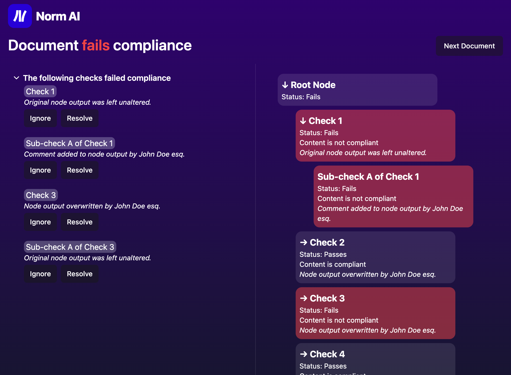

# Norm AI Product Engineer Exercise

The Norm AI product is an agentic copilot for regulatory compliance teams. The objective of this exercise was to build a frontend view for a compliance analyst that visualizes the results of an AI-created compliance analysis on a document.



## Setup

```shell
pnpm i
```

```shell
pnpm dev
```

## High-level Overview

The front end view allows a compliance analyst to be able to

1. Quickly see whether a document is failing or passing compliance
2. Identify the checks that are failing
3. Drill into document structure of the checks,
4. Ignore/resolve any failing checks (visual, but not funcational)

### Assumptions/Rationale

- Since analysts are busy, the most important UI/UX aspect is to know whether a document passes compliance or not. This is achieved through the heading displaying the result and colors indicating failing status.
- Since analysts are detailed and thorough, it is beneficial to reduce noise. This is achieved by allowing analysts to collapse and expand sections of a document and the compliance checks as neccessary
- Since analysts are responsible for any issues in compliance, they need to know what checks are failing (hence the left panel that displays failing checks) and an ability to act on them (hence the ignore/resolve buttons). The ignore/resolve functionality is visual only due to the scope of the objective and research required to implement it properly
- Since analysts have low familiarity with AI-driven products, language must remain straightforward and CTA should be clear

## Technical Implementation

This was bootstrapped using the [T3 Stack](https://create.t3.gg/) which configured:

- [Next.js](https://nextjs.org): React framework
- [Tailwind CSS](https://tailwindcss.com): CSS utility classes
- [tRPC](https://trpc.io): Typesafe APIs

The benefits are that this saved time in terms of configuration and had some small performance benefits. In a real-world application, depending on requirements/scope, I may have considered other options such as [Remix](https://remix.run/) for data/route coupling or even options outside React such as [Solid](https://www.solidjs.com/) for performance gains. Additionally, depending on the size of documents, it may be beneficial to go with a local-first approach and use a library like [Replicache](https://replicache.dev/).

Additionally used the [Shadcn](https://ui.shadcn.com/) UI library for accessible components

Resources used

- Github Copilot for coding assistance
- ChatGPT as a thought partner
- Google Images to see what other compliance software looks like so that I become familiar with what compliance teams are used to

## Considered, But Not Implemented

- Ignore and resolve functionality. Analysts are responsible for complicance issues so they need to be able to act on ducments in review. This could include being able to add comments, modify the document, etc. Due to a conservative scope on the objective and time consideration, this was not implemented but certain pieces were visualized.
- Once checks are ignored or resolved, their should be some approval process. This means some documents may be in a status of _Review_ meaning acting on any failed checks or in a status of _Needing Approval_ for another analyst to verify any resolved/ignored checks.
- Quality of life improvements:
  - Clicking a failing node in the left panel should zoom into the respective node in the right panel
  - Hotkeys for action items such as ignoring and resolving
- Design questions: a few thoughts emerged during design that I did not fully flesh out
  - Is a tree structure the best way to visualize compliance checks? E.g. what about Notion-like pages, clicking into a sub-tree will replace the right panel and the user can go back or deeper as needed
  - If a document passes compliance, should we skip or should their be some sort of verification process?

## Reflective Response

**In what ways can UI/UX design contribute to the transparency and trustworthiness of AI systems in legal and regulatory applications?**

There are a couple of experiences where I learned how crucial UI/UX is in analysis and regulations. In my data visualization class, my professor asserted that the NASA Space Shuttle Challenger disaster could have been prevented with better data visualization, as the anomaly in the O-ring might have been caught. At Epic, I faced a challenge where healthcare documents sent to non-Epic systems lacked custom sections, which compliance analysts needed to know. By designing specific UI components to alert these analysts, we ensured transparency and adherence to compliance requirements.

As regulation grows more complex, the likelihood of software applications failing to accommodate increases. This is where AI can step in. I wrote a [blog post](https://www.roze.dev/writing/ai-will-change-ui-development) discussing the potential of generative UI in transforming frontend development by dynamically rendering interfaces based on viewable data. This concept can be extended to AI systems in regulatory applications, where AI could generate relevant UI components to display compliance issues proactively. If an AI understood healthcare compliance and the codebase, it could generate UI pieces for a HIM compliance officer, preventing major issues. Expanding this idea, an AI agent could have recognized the anomaly in the NASA space shuttle disaster and generated the correct data visualization.

UI/UX design can make AI systems more transparent by clearly presenting data, highlighting critical information, and providing interactive elements for users to understand AI decisions. This builds trust as users can see and comprehend the data and the rationale behind AI actions, ensuring they align with legal and societal norms.
